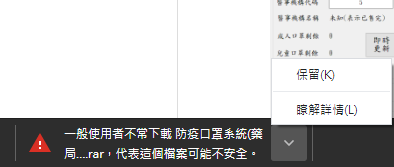
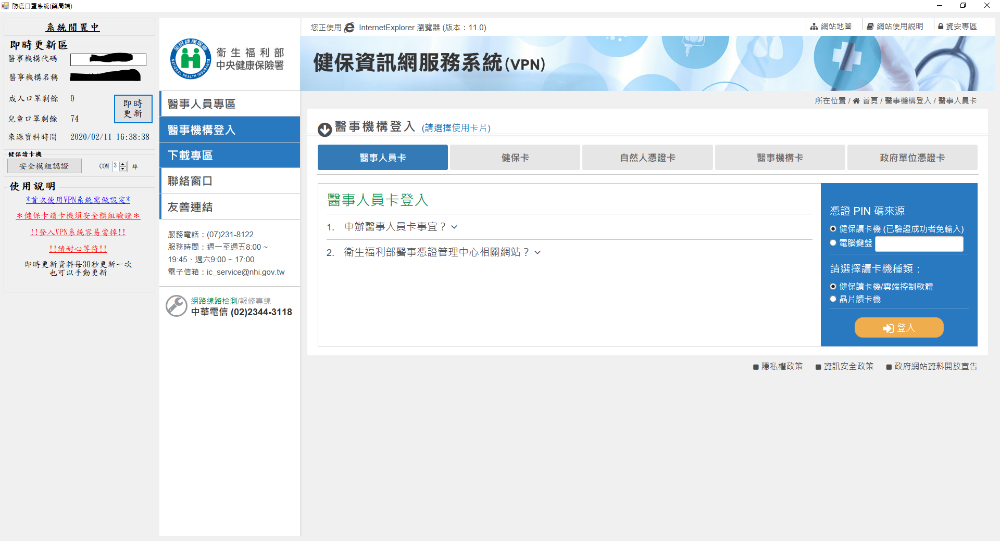
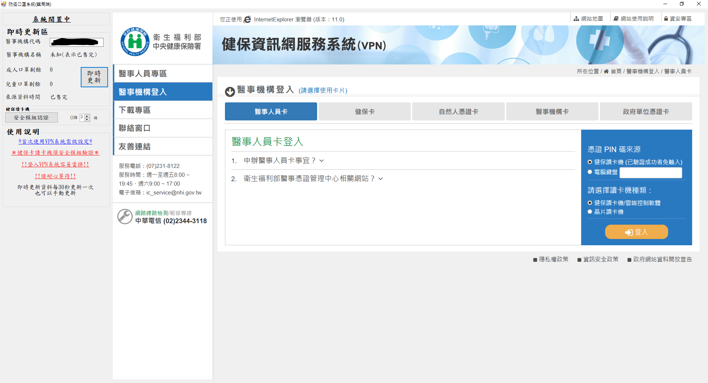

# 防疫口罩系統(藥局端)
此程式開發目的是方便藥局端同時能夠監控藥局的剩餘量，又同時能夠過卡。
## 下載連結
(目前進入VPN系統有點小當) (Chrome可能會擋下)

但是不會被防毒軟體擋下  

[下載連結](https://github.com/k1vink1vin/Vaccination-mask-system-pharmacy-side-/raw/master/%E9%98%B2%E7%96%AB%E5%8F%A3%E7%BD%A9%E7%B3%BB%E7%B5%B1(%E8%97%A5%E5%B1%80%E7%AB%AF).rar "link")
## 使用方法
-   執行mask.exe

跟原本過卡相同，只是增加了旁邊的即時資訊欄，方便藥局進行數量的監控。
此數量是來自於健保署提供的即時資料。 

系統每30秒自動更新一次，亦可手動更新。

-   進入後的預設

-   有庫存狀態

-   無庫存(全數已售完)狀態 (或找無資料)

