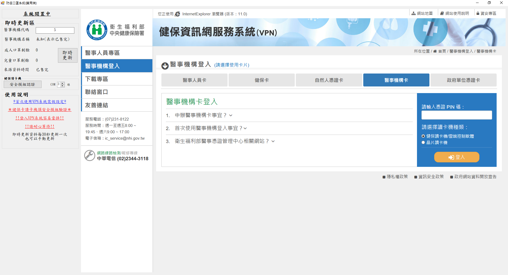

# 防疫口罩系統(藥局端)
此程式開發目的是方便藥局端同時能夠監控藥局的剩餘量，又同時能夠過卡。
## 下載連結
https://drive.google.com/file/d/1nqLwq8snC2_Nx2EawIy3pOnD60ul5Ekp/view?usp=sharing
## 使用方法

跟原本過卡相同，只是增加了旁邊的即時資訊欄，方便藥局進行數量的監控。
此數量是來自於健保署提供的即時資料。 (目前需要手動更新)

-   進入後的預設

-   有庫存狀態

-   無庫存狀態

